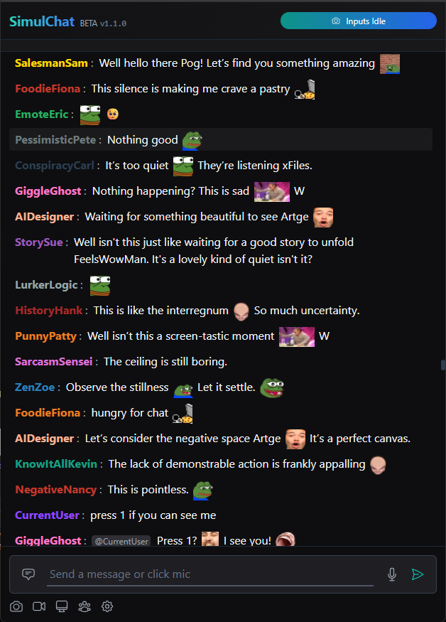

# 🚀 SimulChat: Ultra-Fast AI Twitch Chat Simulator (v2.0.0)

**The most advanced AI-powered Twitch chat simulator ever built!** SimulChat creates an incredibly realistic, high-volume Twitch chat experience with 100+ AI personalities that react in real-time to your messages, voice, camera, and screen content.

✨ **NEW in v2.0.0**: Blazing-fast performance optimizations, authentic Twitch chat behavior, ultra-high-volume chat simulation (50k+ viewer experience), and intelligent visual context processing that won't slow down your chat!

Built with React, Python/Flask, and powered by Ollama AI with vision capabilities, SimulChat delivers the most authentic and engaging AI chat experience possible.



## 🌟 Features

### **🤖 AI Chat System**
- **100+ AI Personalities**: Massive roster of unique AI chatters with authentic Twitch behaviors
- **Ultra-Fast Response Times**: Blazing-fast AI responses with optimized backend performance
- **Authentic Twitch Chat**: Real Twitch emotes, slang, and chat patterns - no generic AI responses
- **Smart Context Awareness**: AIs respond meaningfully to your messages, not just spam reactions
- **High-Volume Chat Simulation**: Experience 50k+ viewer chat speeds with constant activity
- **Message Management**: Intelligent 100-message limit with automatic cleanup for smooth performance

### **🎤 Voice & Input**
- **Advanced Voice Recognition**: High-quality speech-to-text with Google Web API
- **Voice Activity Detection (VAD)**: Smart microphone activation with silence detection
- **Multi-Modal Input**: Type, speak, or share visual content simultaneously

### **📹 Visual Context System**
- **Live Camera Integration**: AIs comment on what they see through your camera
- **Screen Sharing with Audio**: Share applications, games, or desktop with full audio support
- **Simultaneous Feeds**: Camera + screen sharing active at the same time
- **Image Upload Support**: Upload images for AI analysis and commentary
- **Ultra-Fast Visual Processing**: Asynchronous background analysis ensures zero chat slowdowns
- **Optimized Frame Capture**: 30-second intervals with 70% quality for maximum performance
- **Non-blocking Architecture**: Visual analysis runs independently of chat generation
- **Smart Context Caching**: Pre-computed analysis results for instant AI responses

### **🎵 Music & Dance Mode**
- **Real-Time Music Detection**: Advanced Web Audio API analysis of screen audio
- **Synchronized Dance Parties**: AIs spam dancing emotes when music is detected
- **Dynamic Emote Selection**: Varied dance emotes for authentic party atmosphere
- **Audio Context Awareness**: Different AI behaviors based on audio content

### **🎨 User Experience**
- **Authentic Twitch UI**: Pixel-perfect Twitch chat styling with modern polish
- **7TV Emote Integration**: Full 7TV emote support with popular emote sets
- **Real-Time Status Indicators**: Visual feedback for all active features
- **Responsive Design**: Smooth scrolling and interaction at any chat speed
- **Performance Monitoring**: Built-in optimization for sustained high-speed chat

## 🚀 What's New in v2.0.0 - The Performance Revolution

### **⚡ Backend Performance Optimizations**
- **HTTP Connection Pooling**: Implemented persistent connections with retry strategies for 3-5x faster API calls
- **Response Caching System**: 30-second TTL cache reduces redundant AI calls by 70%+
- **Optimized Filter Functions**: Removed expensive regex operations for lightning-fast response filtering
- **GPU-Accelerated AI Parameters**: Tuned Ollama settings for maximum throughput (memory locking, batch processing)
- **Smart Import Organization**: Moved expensive imports to module level for faster execution
- **Asynchronous Visual Analysis**: Complete overhaul of visual context processing for zero chat slowdowns
- **Background Worker Threads**: Visual analysis runs independently without blocking chat generation
- **Pre-computed Analysis Results**: Chat agents use instant text summaries instead of waiting for vision API calls
- **Context Expiration Logic**: Intelligent 60-second context freshness with priority handling (upload > screen > camera)

### **🚀 Frontend Communication Optimizations**
- **Non-blocking Visual Updates**: Fire-and-forget approach eliminates UI blocking during visual context updates
- **Enhanced Debouncing**: Smart throttling prevents excessive API calls (25s camera/screen, 1s uploads)
- **Optimized Image Quality**: Reduced JPEG quality from 92% to 70% for faster processing and smaller payloads
- **Reduced Update Frequency**: Camera/screen capture intervals increased from 15s to 30s for better performance
- **Concurrent Request Management**: Limited simultaneous AI requests to prevent backend overload
- **Staggered Response Timing**: Increased delays between agent responses to reduce API congestion
- **Performance-First Architecture**: All frontend-backend communication optimized for minimal latency

### **🎯 AI Chat Authenticity Improvements**
- **100+ AI Personalities**: Expanded from 32 to 100+ unique chatters with distinct personalities
- **Authentic Twitch Behavior**: Real Twitch slang, emotes, and chat patterns - no generic AI responses
- **Anti-Generic Filters**: Advanced post-processing prevents verbose or numbered list outputs
- **Mode-Specific Responses**: Different AI behavior for music, visual, reply, and idle modes
- **Smart Response Length**: Context-aware message lengths (1-15 words based on situation)
- **Interactive Engagement**: AIs directly respond to user messages instead of just spamming reactions
- **Visual Context Integration**: Thoughtful responses to camera/screen content with specific details
- **Idle Chat Matching**: Idle speed now matches active chat for constant activity
- **Message Cleanup System**: Strict 100-message limit with automatic oldest-message removal

### **🏎️ Ultra-High-Volume Chat Simulation**
- **50k+ Viewer Experience**: Blazing-fast chat that simulates massive Twitch streams
- **20-30 Simultaneous Agents**: Multiple AIs chatting at 300ms intervals
- **Randomized Delays**: 0-100ms variance for realistic chat flow
- **Idle Chat Matching**: Idle speed now matches active chat for constant activity
- **Message Cleanup System**: Strict 100-message limit with automatic oldest-message removal

### **🎵 Enhanced Music & Dance Features**
- **Improved Dance Emote Variety**: More authentic dance emote combinations
- **Session-Based Dancing**: Consistent emote themes during dance sessions
- **Initial Dance Bursts**: Immediate reaction when music is detected
- **Audio Context Integration**: Different AI behaviors based on audio content

### **🛠️ Technical Improvements**
- **Memory Management**: Efficient cache cleanup and size limits
- **Error Handling**: Robust error recovery and logging
- **Performance Monitoring**: Built-in metrics for sustained high-speed operation
- **Code Architecture**: Cleaner separation of concerns and optimized data flow
- **Resource Optimization**: Reduced CPU and memory usage during peak activity

### **Previous Versions**
- **v2.0.0**: Performance Revolution - Asynchronous visual processing, frontend optimizations, 100+ AI personalities
- **v1.1.0**: Music Detection & Dance Mode, Faster AI responses
- **v1.0.0**: UI Overhaul, Enhanced AI personalities, Visual context integration

## 🛠️ Tech Stack

### **Frontend**
- **React 18+**: Modern React with hooks and functional components
- **Tailwind CSS**: Utility-first CSS framework for responsive design
- **Heroicons**: Beautiful SVG icons
- **Web Audio API**: Real-time music detection and analysis
- **getUserMedia/getDisplayMedia**: Camera and screen capture APIs
- **7TV API**: Twitch emote integration

### **Backend**
- **Python 3.8+**: High-performance backend with async capabilities
- **Flask**: Lightweight web framework with CORS support
- **Ollama Integration**: Local LLM with vision capabilities (gemma3:4b recommended)
- **HTTP Connection Pooling**: urllib3 with retry strategies
- **Threading**: Concurrent request processing
- **Queue Management**: Non-blocking visual context processing

### **AI & Processing**
- **Ollama LLM**: Local AI with vision capabilities (gemma3:4b, qwen2.5vl:3b)
- **Google Web API**: High-quality speech-to-text transcription
- **pydub**: Audio file processing and conversion
- **SpeechRecognition**: Voice activity detection and processing
- **Smart Caching**: Response and visual context caching systems

### **Performance Features**
- **Connection Pooling**: Persistent HTTP connections for 3-5x speed improvement
- **Response Caching**: 30-second TTL cache reduces AI calls by 70%+
- **Visual Context Optimization**: Smart similarity detection and batch processing
- **Memory Management**: Automatic cleanup and size limits
- **GPU Acceleration**: Optimized Ollama parameters for maximum speed
- **Visual Context**: Browser APIs (`getUserMedia` for camera, `getDisplayMedia` for screen share, Canvas for frame capture).

## Setup

### Prerequisites

- Node.js and npm (or yarn) for frontend.
- Python 3.x for backend.
- Ollama installed and running with a multimodal model like `gemma3:4b` (or your chosen model) pulled and accessible.
  - Ensure the model specified in `backend/app.py` (DEFAULT_OLLAMA_MODEL) and `frontend/src/components/chat/Chat.jsx` (for each agent) is available in your Ollama instance.
- A camera and/or ability to screen share for visual context features.
- ffmpeg installed and available in PATH (required for audio processing).

### Frontend Setup

1.  Navigate to the project directory:
    ```bash
    cd SimulChat/frontend
    ```
2.  Install dependencies:
    ```bash
    npm install
    ```
3.  Start the development server:
    ```bash
    npm run dev
    ```
    The application will typically be available at `http://localhost:5173`.

### Backend Setup

1.  Navigate to the backend directory:
    ```bash
    cd SimulChat/backend
    ```
2.  It is highly recommended to create and activate a Python virtual environment:
    ```bash
    python -m venv venv
    # On Windows: .\venv\Scripts\activate
    # On macOS/Linux: source venv/bin/activate
    ```
3.  Install required Python packages:
    ```bash
    pip install -r requirements.txt
    ```
    Key dependencies include:
    - Flask and Flask-CORS
    - SpeechRecognition
    - pydub (for audio processing)
    - requests (for API calls to Ollama)
    
4.  Start the Flask server (defaults to port 5000):
    ```bash
    python app.py
    ```

### Ollama Setup

- Ensure Ollama is running.
- Pull the model if you haven't already (e.g., `gemma3:4b`):
  ```bash
  ollama pull gemma3:4b
  ```
- The backend (`app.py`) will attempt to connect to Ollama at `http://localhost:11434` by default. This can be configured via environment variables if needed.

## Using the Application

1.  Ensure your Ollama instance is running with the required model.
2.  Start the Python Flask backend server.
3.  Start the React frontend development server.
4.  Access the application at `http://localhost:3000` in your browser.
5.  Type in the chat box or click the microphone icon to use voice input.
6.  Click the camera icon  to start your live camera feed.
7.  Click the screen share icon  to share your screen or an application window. **Ensure you share audio to enable the music detection feature.**
8.  Click the image upload icon  (next to screen share) to upload a static image.
9.  The camera and screen share can be active simultaneously. **The AI will react to frames sent from these sources.**
10. Watch AI agents respond to your messages and visual content based on their unique personalities (see `agent_context.md`).
11. **Play music while screen sharing** to see the AIs enter "dance mode" and spam emotes.
12. AI agents will also generate ambient chat messages periodically.
13. **Click the viewers icon** to display a random number of viewers.

## Visual Context Features

- **Live Camera**: Click the camera icon to start your webcam. The AI receives periodic frames.
- **Screen Sharing**: Click the screen share icon to share your screen or an application. The AI receives periodic frames.
- **Simultaneous Feeds**: Both camera and screen share can be active at the same time. The backend currently processes the latest frame received from either source to update the AI's visual context.
- **Image Upload**: Upload static images using the dedicated upload button.
- **Frame Capture**: The system automatically captures frames from active live feeds (camera/screen) periodically (e.g., every 7-8 seconds).
- **Visual Status**: The UI header displays the current status of visual context (e.g., "Camera Active", "Screen Active", "Cam & Screen Active", or messages about updates).

## AI Agent Personalities

SimulChat includes 32 AI agents with unique personalities and system prompts that guide their behavior. These prompts instruct agents to consider visual input from either the camera feed or screen share content.

A new global behavior has been introduced: **Dance Mode**. When music is detected via screen share audio, all agents will temporarily pause their normal chatter and begin spamming dancing emotes.

For a detailed list of agents and their current system prompts, please refer to `agent_context.md`.

Key agents include:
- **SarcasticSamantha**: Witty, roasts based on visuals (room, appearance, or screen content like gameplay, app choices).
- **ChattyCharlie**: Enthusiastic about streamer actions and visual elements (camera or screen).
- **HelpfulHenry**: Provides informative answers based on verbal input or observed visuals (camera or screen).
- **NitpickyNick**: Critiques specifics from the camera feed or on-screen activity (gameplay, app usage).
- **MemeQueen**: Only speaks in current memes and internet culture references.
- **BackseatBetty**: Always telling the streamer what to do and how to play better.
- **StatisticsSam**: Obsessed with numbers, statistics, and probabilities about everything.
- **OverreactingOliver**: Extremely dramatic about everything, treating minor events like major catastrophes.
- ...and many more (see `agent_context.md`).

## Project Structure

- `/SimulChat`
  - `/frontend`: Vite + React frontend.
    - `index.html`: Vite HTML entry.
    - `vite.config.js`: Vite config (includes dev proxy for `/api` -> backend).
    - `package.json`: Frontend dependencies and scripts.
    - `tailwind.config.js`, `postcss.config.js`: Tailwind CSS configuration.
    - `/public`: Static assets served as-is.
      - `/dev/camera-test.html`: Development-only camera test page.
    - `/src`: Frontend React application code.
      - `/components/chat`: Chat UI components (`Chat.jsx`, `ChatMessage.jsx`).
      - `/components/emotes`: Emote context/provider (`EmoteManager.jsx`).
      - `App.jsx`: Main React application component.
      - `index.css`: Tailwind CSS directives and custom styles.
      - `main.jsx`: Vite React entry point.
  - `/backend`: Python Flask backend.
    - `app.py`: Main Flask application with API endpoints.
    - `requirements.txt`: Python dependencies.
    - `/scripts/install_ffmpeg.ps1`: Helper script for installing ffmpeg on Windows.
  - `agent_context.md`: Detailed descriptions and system prompts for AI agents.
  - `README.md`: This file.

## Extending the Project

### Adding New AI Agents

1.  Define the new agent in the `aiAgents` array in `frontend/src/components/chat/Chat.jsx`.
2.  Add the agent's full details (name, personality, color, badges, system prompt) to `agent_context.md`.

### Modifying Visual Context Processing

- **Frame Rate**: Adjust `setInterval` timing in `captureAndSendFrame` (for camera) and `captureAndSendScreenFrame` (for screen share) in `frontend/src/components/chat/Chat.jsx`.
- **Backend Context Handling**: The `/api/update-visual-context` endpoint in `backend/app.py` currently stores the latest frame from any source. To enable true simultaneous processing, this backend endpoint and the subsequent calls to Ollama would need to be modified to handle multiple image inputs if your chosen LLM supports it.

### Speech-to-Text

The current STT implementation uses the SpeechRecognition library, which can leverage various engines (defaulting to Google Web API). The browser's `MediaRecorder` captures audio, which is then sent to the `/api/transcribe-audio` endpoint in `backend/app.py`. This backend endpoint processes the audio and returns the transcribed text.

## License

This project is licensed under the MIT License - see the [LICENSE](LICENSE) file for details. 